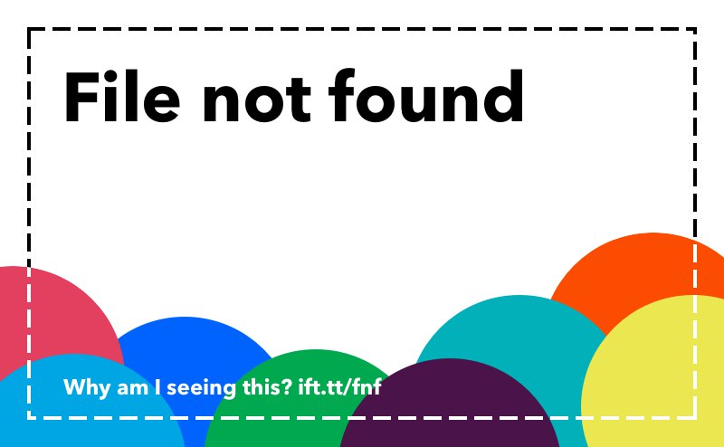

### NOT FOUND bot
This GitHub repository houses the source code for a Telegram bot designed to assist in managing the content of a Telegram channel used for IFTTT automation. The bot's primary function is to automatically detect and remove images with the "File Not Found" message that are posted to the channel by the IFTTT automation service.

### License
This tool is licensed under the [MIT License](LICENSE.md).
